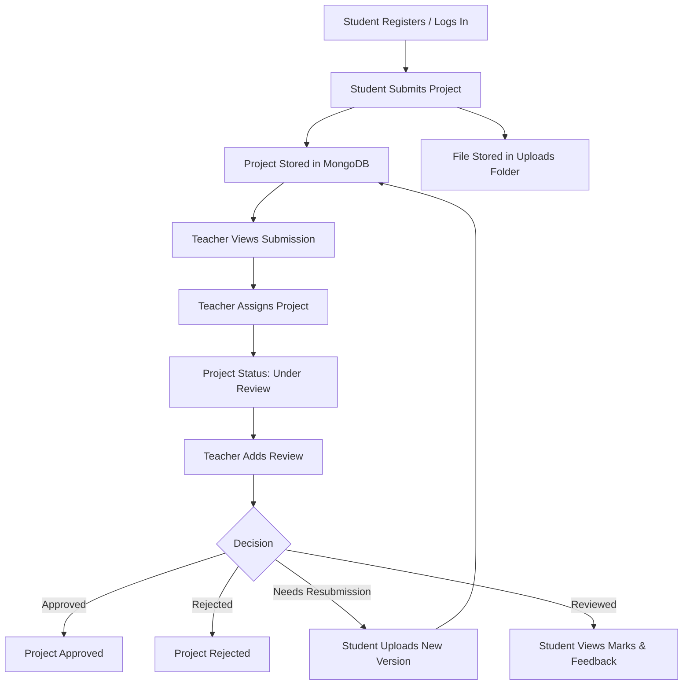
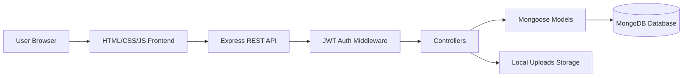

# 🎓 ProjectHub — Project Submission & Review System

<p align="center">
  
</p>

<p align="center">
  
  
  
  
  
</p>

<p align="center">
  A full-stack web application that helps students submit academic projects and enables teachers to review, grade, approve, reject, or request resubmission with version tracking.
</p>

---

## 📌 Table of Contents

- [About the Project](#-about-the-project)
- [Key Features](#-key-features)
- [User Roles](#-user-roles)
- [Tech Stack](#-tech-stack)
- [Project Workflow](#-project-workflow)
- [System Architecture](#-system-architecture)
- [Folder Structure](#-folder-structure)
- [Installation & Setup](#-installation--setup)
- [Environment Variables](#-environment-variables)
- [API Endpoints](#-api-endpoints)
- [Screenshots](#-screenshots)
- [Future Enhancements](#-future-enhancements)
- [Author](#-author)

---

## 🚀 About the Project

**ProjectHub** is a project submission and review management platform designed for colleges, departments, teachers, and students.

Instead of handling submissions through emails, WhatsApp messages, or scattered drive links, this system provides one centralized workflow where:

- Students can upload project files.
- Teachers can review submitted projects.
- Students can upload improved versions.
- Teachers can give marks, comments, feedback, and status updates.
- Both roles can track project progress through dashboards.

---

## ✨ Key Features

### 👨‍🎓 Student Features

| Feature | Description |
|---|---|
| 🔐 Authentication | Student registration and login with JWT-based secure session |
| 📤 Project Submission | Upload project file with title, description, category, deadline, and version notes |
| 📦 File Upload Support | Supports PDF, ZIP, RAR, DOCX, PPTX, TXT, JPG, and PNG files |
| 🔁 Version Upload | Upload new project versions after teacher feedback |
| 📊 Dashboard Stats | View total, pending, under-review, reviewed, rejected projects, and average marks |
| 💬 Review History | See teacher comments, feedback, marks, and final decision |
| 🔎 Search & Filter | Search projects and filter by status |

### 👨‍🏫 Teacher Features

| Feature | Description |
|---|---|
| 🔐 Teacher Login | Role-based login for teachers |
| 📁 All Projects View | View all submitted projects from students |
| 🧑‍🏫 Assign Project | Assign project to self and mark it as under review |
| ✍️ Review Project | Add comments, detailed feedback, marks, and decision |
| ✅ Status Management | Mark project as reviewed, approved, rejected, or resubmission required |
| 📜 Review Management | View, edit, and delete own reviews |
| 📊 Teacher Dashboard | View project statistics and submission status summary |

---

## 🧑‍💻 User Roles

<details>
<summary><strong>👨‍🎓 Student Role</strong></summary>

Students can:

- Create an account.
- Login securely.
- Submit project files.
- Add project details and deadline.
- Upload new versions.
- View teacher feedback.
- Track project status.
- Check marks and review history.

</details>

<details>
<summary><strong>👨‍🏫 Teacher Role</strong></summary>

Teachers can:

- Login securely.
- View all project submissions.
- Search and filter projects.
- Assign projects to themselves.
- Review project submissions.
- Give marks out of 100.
- Approve, reject, review, or request resubmission.
- Edit and delete their own reviews.

</details>

---

## 🛠️ Tech Stack

| Layer | Technology |
|---|---|
| Frontend | HTML5, CSS3, JavaScript |
| Backend | Node.js, Express.js |
| Database | MongoDB, Mongoose |
| Authentication | JWT, bcryptjs |
| File Upload | Multer |
| Styling | Custom CSS |
| Deployment Config | Vercel / Node Server Config |

---

## 🔄 Project Workflow



---

## 🏗️ System Architecture



---

## 📁 Folder Structure

```bash
Project-Submission-System-main/
│
├── backend/
│   ├── config/
│   │   ├── db.js              # MongoDB connection
│   │   └── multer.js          # File upload configuration
│   │
│   ├── controllers/
│   │   ├── authController.js  # Register, login, profile, teachers
│   │   ├── projectController.js
│   │   └── reviewController.js
│   │
│   ├── middleware/
│   │   └── auth.js            # JWT protection and role authorization
│   │
│   ├── models/
│   │   ├── User.js            # Student / Teacher model
│   │   ├── Project.js         # Project and version schema
│   │   └── Review.js          # Review and feedback schema
│   │
│   ├── routes/
│   │   ├── auth.js
│   │   ├── project.js
│   │   └── review.js
│   │
│   ├── uploads/               # Uploaded project files
│   ├── package.json
│   └── server.js              # Main Express server
│
├── frontend/
│   ├── css/
│   │   └── style.css
│   │
│   ├── js/
│   │   ├── api.js             # Backend API calls
│   │   ├── auth.js            # Login/register logic
│   │   ├── student.js         # Student dashboard logic
│   │   ├── teacher.js         # Teacher dashboard logic
│   │   ├── upload.js          # Project upload logic
│   │   ├── review.js          # Review page logic
│   │   └── utils.js           # Common helper functions
│   │
│   ├── index.html
│   ├── student-dashboard.html
│   ├── teacher-dashboard.html
│   ├── upload-project.html
│   └── review.html
│
├── vercel.json
└── README.md
```

---

## ⚙️ Installation & Setup

### 1️⃣ Clone the Repository

```bash
git clone https://github.com/your-username/project-submission-system.git
cd project-submission-system
```

### 2️⃣ Install Backend Dependencies

```bash
cd backend
npm install
```

### 3️⃣ Create Environment File

Create a `.env` file inside the `backend/` folder.

```env
PORT=5000
MONGO_URI=your_mongodb_connection_string
JWT_SECRET=your_super_secret_jwt_key
JWT_EXPIRE=7d
```

### 4️⃣ Configure Frontend API Base URL

Open:

```bash
frontend/js/api.js
```

For local development, use:

```js
const API_BASE = 'http://localhost:5000/api';
```

If frontend and backend are deployed on the same domain, you can use:

```js
const API_BASE = '/api';
```

### 5️⃣ Run the Project

From the `backend/` folder:

```bash
npm run dev
```

Or run normally:

```bash
npm start
```

### 6️⃣ Open in Browser

```bash
http://localhost:5000
```

---

## 🔐 Environment Variables

| Variable | Required | Description |
|---|---|---|
| `PORT` | No | Server port. Default is `5000` |
| `MONGO_URI` | Yes | MongoDB connection string |
| `JWT_SECRET` | Yes | Secret key used to sign JWT tokens |
| `JWT_EXPIRE` | Yes | JWT token expiry time, for example `7d` |

> ⚠️ Never commit your real `.env` file to GitHub.

---

## 📡 API Endpoints

### 🔐 Authentication Routes

| Method | Endpoint | Access | Description |
|---|---|---|---|
| `POST` | `/api/auth/register` | Public | Register student or teacher |
| `POST` | `/api/auth/login` | Public | Login user |
| `GET` | `/api/auth/me` | Protected | Get logged-in user profile |
| `GET` | `/api/auth/teachers` | Protected | Get list of teachers |

### 📁 Project Routes

| Method | Endpoint | Access | Description |
|---|---|---|---|
| `POST` | `/api/projects` | Student | Submit a new project |
| `POST` | `/api/projects/:id/version` | Student | Upload new project version |
| `GET` | `/api/projects/my` | Student | Get logged-in student's projects |
| `GET` | `/api/projects` | Teacher | Get all projects |
| `GET` | `/api/projects/:id` | Protected | Get single project details |
| `PUT` | `/api/projects/:id/assign` | Teacher | Assign project to teacher |
| `PUT` | `/api/projects/:id/status` | Teacher | Update project status and marks |
| `DELETE` | `/api/projects/:id` | Protected | Delete project |
| `GET` | `/api/projects/stats` | Protected | Get dashboard statistics |

### 💬 Review Routes

| Method | Endpoint | Access | Description |
|---|---|---|---|
| `POST` | `/api/reviews/:projectId` | Teacher | Add review for project |
| `GET` | `/api/reviews/:projectId` | Protected | Get reviews of a project |
| `GET` | `/api/reviews/teacher/all` | Teacher | Get all reviews written by teacher |
| `PUT` | `/api/reviews/single/:reviewId` | Teacher | Update review |
| `DELETE` | `/api/reviews/single/:reviewId` | Teacher | Delete review |

---

## 🧾 Project Status Values

| Status | Meaning |
|---|---|
| `pending` | Project submitted and waiting for teacher action |
| `under_review` | Teacher has assigned or started checking the project |
| `reviewed` | Project has been reviewed |
| `approved` | Project has been accepted |
| `rejected` | Project has been rejected |
| `resubmit` | Student needs to upload an improved version |

---

## 📦 Supported File Uploads

The system supports project files up to **50 MB**.

| File Type | Supported |
|---|---|
| PDF | ✅ |
| ZIP | ✅ |
| RAR | ✅ |
| DOC / DOCX | ✅ |
| PPT / PPTX | ✅ |
| TXT | ✅ |
| JPG / JPEG | ✅ |
| PNG | ✅ |

---

## 🖼️ Screenshots

Add your project screenshots here after running the application.

```md


```

Suggested screenshots to add:

- Login/Register page
- Student dashboard
- Project upload page
- Teacher dashboard
- Review modal/page
- Review history section

---

## ✅ Best Practices Before Pushing to GitHub

Make sure these files and folders are not committed:

```gitignore
node_modules/
.env
backend/.env
backend/uploads/
```

Also consider adding an `.env.example` file:

```env
PORT=5000
MONGO_URI=your_mongodb_connection_string
JWT_SECRET=your_jwt_secret
JWT_EXPIRE=7d
```

---

## 🚀 Future Enhancements

- 📧 Email notifications after review submission
- ☁️ Cloud storage for uploaded files using Cloudinary, AWS S3, or Firebase Storage
- 📈 Analytics dashboard for department-level project performance
- 🧑‍⚖️ Admin panel for managing students, teachers, and departments
- 🔔 Notification system for resubmission and deadline reminders
- 📝 Plagiarism checking for submitted reports/code
- 🔍 Advanced search by student name, department, marks, and date
- 📄 PDF report generation for reviewed projects
- 🌙 Dark mode support

---

## 🤝 Contribution Guide

Contributions are welcome!

```bash
# Fork the repository
# Create a new branch
git checkout -b feature/your-feature-name

# Commit your changes
git commit -m "Add your feature"

# Push to GitHub
git push origin feature/your-feature-name
```

Then open a Pull Request.

---

## 👨‍💻 Author

**Samir Patil**  
Aspiring AI/ML Engineer & Computer Engineering Student

<p align="left">
  <a href="https://github.com/sameerpatil5106">
    
  </a>
  <a href="https://www.linkedin.com/in/your-linkedin-profile">
    
  </a>
</p>

---

## ⭐ Support

If this project helped you, consider giving it a ⭐ on GitHub.

<p align="center">
  <strong>Made with ❤️ for smooth project submission and academic review management.</strong>
</p>
